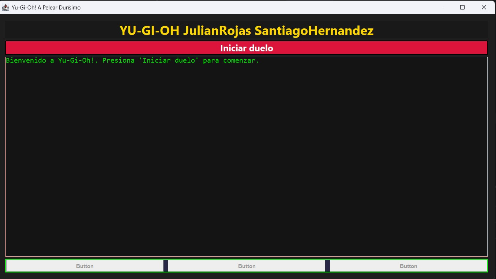
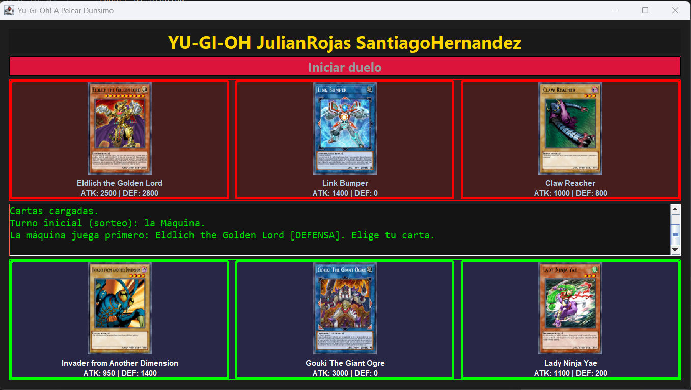
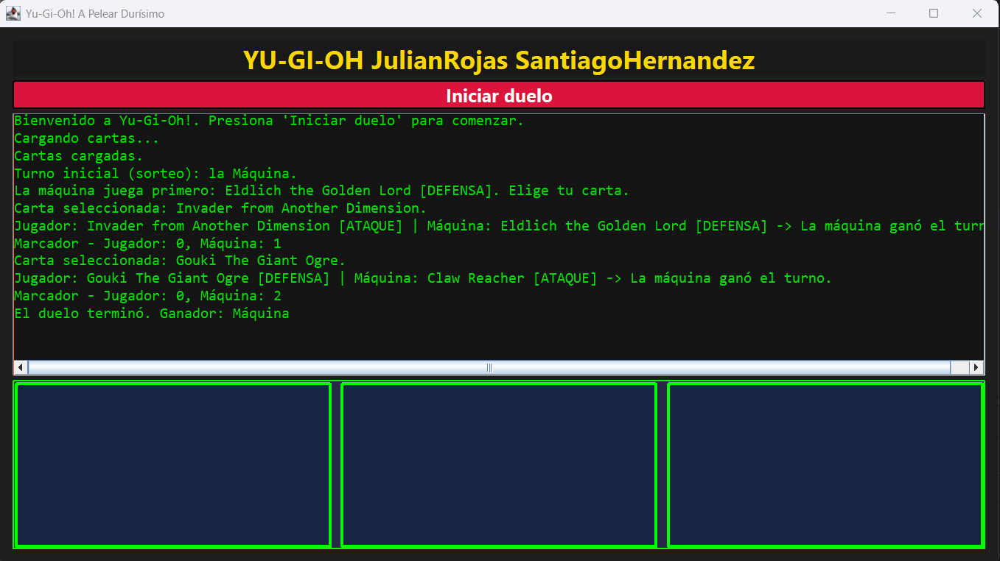
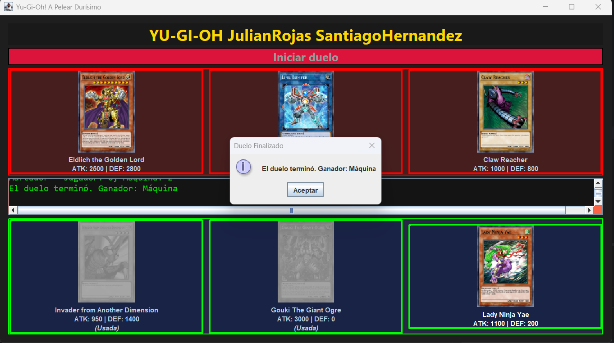
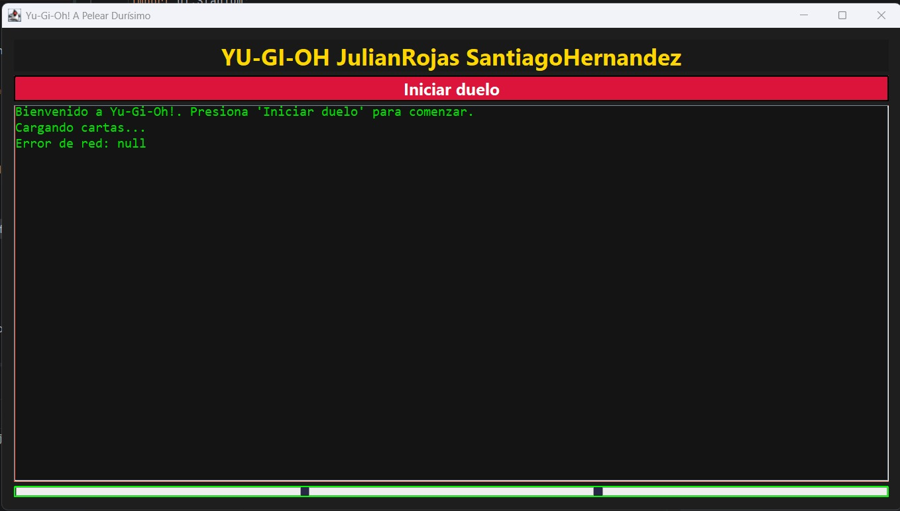

# Yu-Gi-Oh! Duel Lite

Laboratorio #1 · Desarrollo de Software III
Programa: Tecnología en Sistemas · Universidad del Valle, Sede Tuluá
Docente: Mg(c). Juan Pablo Pinillos Reina

**Integrantes:** Julián Rojas y Santiago Hernández
 
---

## Descripción

Mini-aplicación de escritorio en **Java Swing** que simula un duelo sencillo de Yu-Gi-Oh! entre el jugador y la máquina. Las cartas se obtienen en vivo desde la API pública [YGOProDeck](https://db.ygoprodeck.com/api-guide/) (`randomcard.php`).

Cada bando recibe **3 cartas Monster** aleatorias, con imagen, nombre, ATK y DEF. Gana el duelo quien consiga primero **2 de 3 rondas**.

## Requisitos

- **Java 11 o superior** (se usa `java.net.http.HttpClient`).
- Librería **org.json** (`json-20230227.jar`, incluida en la carpeta `lib`).
- Conexión a internet para descargar las cartas y sus imágenes.
## Instrucciones de ejecución

### Desde IntelliJ IDEA

1. Abrir la carpeta del proyecto `Lab1.0DDS3` con **File → Open**.
2. Agregar la librería JSON si no aparece cargada:
   **File → Project Structure → Libraries → + → Java** y seleccionar `lib/json-20230227.jar`.
3. En **File → Project Structure → Project**, verificar que haya un **SDK** (Java 11+) y un **Compiler output** (por ejemplo, la carpeta `out`).
4. Compilar con **Build → Rebuild Project**.
5. Abrir `src/main.java` y ejecutar con el botón verde ▶ junto a `public static void main`.
### Cómo se juega

1. Pulsar **Iniciar duelo**. Se descargan 3 cartas para cada bando.
2. Se sortea quién empieza. Si empieza la máquina, anuncia su carta antes de que el jugador elija.
3. Elegir una de las cartas propias (borde verde) y escoger su posición: **Ataque** o **Defensa**.
4. La máquina juega una carta al azar con posición aleatoria. Se compara ATK vs DEF y el ganador suma **1 punto de ronda**.
5. El primero en llegar a **2 rondas** gana el duelo. El resultado se anuncia en pantalla y en el log.
### Reglas de combate

| Jugador | Máquina | Resultado |
|---|---|---|
| Ataque | Ataque | Gana el mayor ATK |
| Ataque | Defensa | ATK del atacante vs DEF del defensor |
| Defensa | Ataque | ATK del atacante vs DEF del defensor |
| Defensa | Defensa | Empate (nadie ataca) |

## Estructura del proyecto

```
src/
├── API/
│   └── YgoApiClient.java      // Consulta la API y parsea el JSON
├── Logic/
│   ├── BattleListener.java    // Interfaz de eventos del duelo
│   └── Duel.java              // Reglas y lógica del enfrentamiento
├── Model/
│   └── Card.java              // Modelo de carta (nombre, atk, def, imagen, posición)
├── UI/
│   ├── Stadium.java           // Ventana principal (Swing)
│   └── Stadium.form           // Diseño de la interfaz
└── main.java                  // Punto de entrada
lib/
└── json-20230227.jar
```

## Explicación del diseño

El proyecto separa responsabilidades en paquetes. `Model.Card` representa una carta; `API.YgoApiClient` consume `randomcard.php` con `HttpClient`, interpreta el JSON con `org.json` y vuelve a solicitar una carta mientras la recibida no sea de tipo *Monster*. `Logic.Duel` contiene las reglas (sorteo del turno inicial, comparación ATK/DEF, marcador y fin del duelo) y no conoce nada de Swing.

La lógica y la interfaz se comunican mediante la interfaz `BattleListener`, que notifica `onTurn`, `onScoreChanged` y `onDuelEnded` (además de `onDuelStarted` y `onAiPlayed`). `UI.Stadium` implementa ese listener y actualiza el log de batalla (`JTextArea` dentro de un `JScrollPane`), por lo que la lógica puede cambiarse o probarse sin tocar la interfaz.

Para no bloquear el hilo de la UI, las 6 cartas y sus imágenes se descargan en un hilo secundario. Solo cuando todo está cargado se actualiza la interfaz con `SwingUtilities.invokeLater` y se inicia el duelo. Los errores de red o de carga se muestran en el log.

## Capturas de pantalla

### Pantalla inicial


### Cartas cargadas
 

### Selección de posición (Ataque / Defensa)
.png)

### Log de batalla durante el duelo
 

### Anuncio del ganador
 

### Manejo de errores (sin internet)


## Tecnologías

- Java 11+ · Swing
- `java.net.http.HttpClient`
- `org.json`
- API YGOProDeck